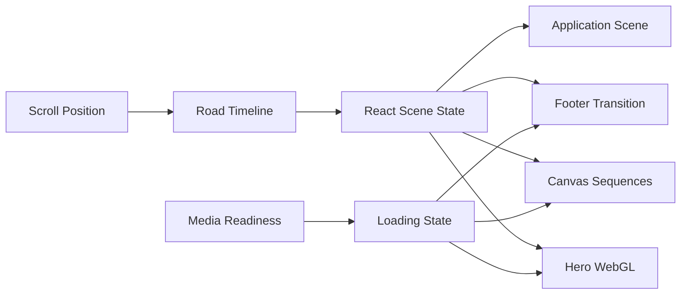

# Pear.No Clone

[中文文档](https://github.com/amasun/Pear-no/blob/main/README.md) · [English](https://github.com/amasun/Pear-no/blob/main/README.en.md) · [REPLICATION_LESSONS](https://github.com/amasun/Pear-no/blob/main/REPLICATION_LESSONS.md)

<p align="center">
  
  
  
  
</p>

<p align="center">
  <strong>Scroll-driven creative web experience recreation</strong><br />
  WebGL shaders · Canvas sequences · Responsive storytelling · Resource-safe transitions
</p>


A React + Vite recreation of the [pear.no](https://pear.no/) experience, focused on scroll-driven storytelling, WebGL backgrounds, frame sequences, mask compositing, and responsive layout.

Original site: [https://pear.no/](https://pear.no/)


## Preview

<video src="docs/assets/preview.mp4" controls muted loop playsinline width="100%"></video>

[Download preview video](docs/assets/preview.mp4)

## Table of Contents

- [Overview](#overview)
- [Tech Stack](#tech-stack)
- [Getting Started](#getting-started)
- [Interaction and Loading](#interaction-and-loading)
- [System Architecture](#system-architecture)
- [Project Structure](#project-structure)
- [Replication Notes](#replication-notes)

## Overview

| Module | Status | Description |
| --- | :---: | --- |
| Hero WebGL | `READY` | GLSL hero shader with a shared hero video clock |
| Scroll Road | `READY` | One logical timeline across desktop and mobile |
| Mask Calibration | `READY` | Double-click to open; tune position, zoom, and sensitivity |
| Fly / Transition | `READY` | Frame warm-up and last-available-frame fallback |
| Footer Shader | `READY` | Displays only after its textures are ready |
| Application | `READY` | Form scene, hover depth, and application modal |

## Toolchain

| Stage | Tools | Purpose |
| --- | --- | --- |
| Original project implementation | ChatGPT · Seedance · Claude | Image prompting and asset generation, slow-motion footage, and production code |
| Replication and reconstruction | ChatGPT · Gemini | Runtime analysis, visual comparison, code recreation, and debugging |

The original creation pipeline is based on the creator's publicly described workflow. The replication tools serve a different purpose: understanding source behavior and rebuilding the experience locally.


## Tech Stack

| Layer | Technologies |
| --- | --- |
| Application | React 19 · Vite 6 · pnpm |
| Graphics | WebGL · GLSL · HTML Canvas 2D |
| Motion | Scroll timeline · requestAnimationFrame · CSS motion |
| Visual system | SVG overlays · Chroma-key masking · Responsive layout |

## Animation Asset Inventory

| Animation segment | Asset type | Count | Asset link |
| --- | --- | ---: | --- |
| Hero / Signal | MP4 + poster | 1 MP4 | [`signal.mp4`](public/films/signal.mp4) · [`poster`](public/films/signal-poster.jpg) |
| Hero / Colossus | MP4 + poster | 1 MP4 | [`colossus.mp4`](public/films/colossus.mp4) · [`poster`](public/films/colossus-poster.jpg) |
| Hero / Reveal | MP4 + poster | 1 MP4 | [`reveal.mp4`](public/films/reveal.mp4) · [`poster`](public/films/reveal-poster.jpg) |
| Model / Bridge v28 | WebP sequence | 121 / tier | [`v28`](public/films/model/v28/) |
| Model / Bridge v51 | WebP sequence | 121 / tier | [`v51`](public/films/model/v51/) |
| Model / Bridge v61 | WebP sequence | 121 / tier | [`v61`](public/films/model/v61/) |
| Model / Renaissance | WebP sequence | 362 / tier | [`renaissance`](public/films/model/renaissance/) |
| Coda | WebP sequence | 89 / tier | [`coda`](public/films/coda/) |
| Plan | WebP sequence | 121 / tier | [`plan`](public/films/plan/) |
| Tree | WebP sequence | 121 / tier | [`tree`](public/films/tree/) |
| Flysky | WebP sequence | 121 / tier | [`flysky`](public/films/flysky/) |
| Transition | WebP sequence | 121 / tier | [`trans`](public/films/trans/) |
| Footer loop | MP4 | 1 MP4 | [`footer-loop.mp4`](public/films/footer-loop.mp4) |

> `/ tier` means desktop and mobile each have a dedicated asset set. Each Model bridge and Renaissance sequence contains 121 and 362 frames respectively, giving 483 logical frames for one Model sequence.

```text
Browser
  ├─ React App
  │   ├─ Scroll Road / Navigation / Narrative
  │   ├─ HeroCanvas ─────── GLSL + shared hero video
  │   ├─ SequenceCanvas ─── 2D frames + mask compositing
  │   ├─ ApplicationScene ─ form scene + orbit geometry
  │   └─ FooterTransition ─ WebGL texture transition
  └─ public/films ───────── local video, poster, and frame assets
```

## Getting Started

This repository uses **pnpm**.

```bash
pnpm install
pnpm dev
```

The development server runs on:

`http://localhost:3000/`

Production build and preview:

```bash
pnpm build
pnpm preview
```

## Interaction and Loading

### Initial Loading

The initial loading state is driven by actual media readiness. Once the poster or hero video can be drawn, the loading state releases; a fixed delay cannot expose a blank canvas.

If both opening assets fail for 10 seconds, the page reports the failure and exposes a `Retry` action.

Fly, transition, and footer stages load non-blockingly. During a fast jump, the site keeps the last available frame visible and reports the active phase while assets finish loading, preventing a black screen.

### Mask Calibration Panel

> [!IMPORTANT]
> **The calibration panel is hidden by default. Double-click an empty area of the page to open or close it.**

The panel provides:

- `Zoom / Overscan`
- `Object Position X`
- `Sky Sensitivity`
- Mask debug toggle
- Reset and preset controls
- Road position readout and draggable locator

Calibration values are stored in the browser's `localStorage`.

### Application Scene

The Application section contains three dashed ellipses, glowing particles, form fields, and a submit button. The ellipses preserve the source site's static orientation instead of introducing an unexpected fast rotation.


## System Architecture



## Screenshot Gallery

| Hero | Model | Terms |
| --- | --- | --- |
|  |  |  |

## Project Structure

- `src/App.jsx` — app composition, scroll state, calibration state, and orchestration
- `src/timeline.js` — logical road length and scroll-progress remapping
- `src/components/` — UI, canvas, modal, loading, and narrative sections
- `src/glsl/` — hero and footer transition shader sources
- `public/films/` — local videos, posters, and frame sequences
- `docs/assets/` — README preview images

## Common Commands

| Command | Purpose |
| --- | --- |
| `pnpm dev` | Start the development server |
| `pnpm build` | Create a production build |
| `pnpm preview` | Preview the production build |
| Double-click the page | Open / close the mask calibration panel |

## Replication Notes

This project is intended for local research and technical learning. Visual assets, branding, and source-site content remain the property of their respective owners; do not use them for commercial publication without permission.

The technical analysis, animation breakdowns, resource-loading investigations, and implementation lessons are documented in [REPLICATION_LESSONS.md](REPLICATION_LESSONS.md).

### REPLICATION_LESSONS Summary

- Treat the site as a scroll-driven narrative system, not as a collection of static sections.
- Define one logical Road timeline and map physical scroll positions into scene start, hold, and exit windows.
- Treat videos and frame sequences as timed visual assets with explicit cover rules, anchors, mobile variants, and crossfades.
- Drive grid lines, typography, ink effects, masks, and hover depth from scene state instead of fixed decoration or layout changes.
- Use real alpha compositing for the ink effect and compositing-layer transforms for stable form hover motion.
- Validate scene boundaries, loading fallbacks, computed styles, and production builds on both desktop and mobile.

For the Chinese version, see [README.md](README.md).

## Credits

Recreated by Artgineer

- [GitHub](https://github.com/amasun?tab=repositories)
- [Xiaohongshu](https://www.xiaohongshu.com/user/profile/5c094b50f7e8b948da476607)
