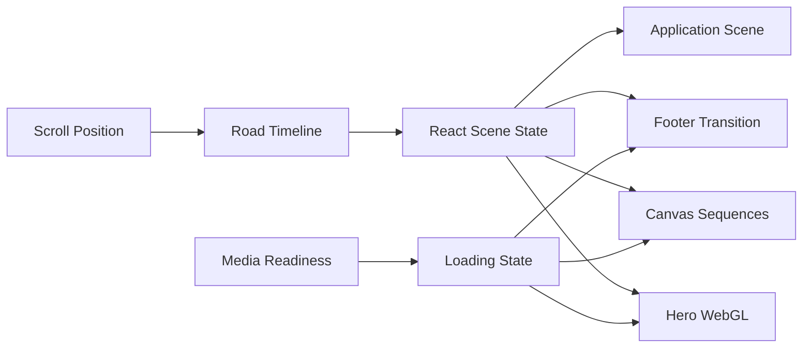

# Pear.No Clone

[中文文档](https://github.com/amasun/Pear-no/blob/main/README.md) · [English](https://github.com/amasun/Pear-no/blob/main/README.en.md) · [REPLICATION_LESSONS](https://github.com/amasun/Pear-no/blob/main/REPLICATION_LESSONS.md)

<p align="center">
  
  
  
  
</p>

<p align="center">
  <strong>Scroll-driven creative web experience recreation</strong><br />
  WebGL shaders · Canvas sequences · Responsive storytelling · Resource-safe transitions
</p>


这是一个基于 React + Vite 的 pear.no 网站体验复刻项目，重点还原滚动叙事、WebGL 背景、序列帧动画、遮罩合成和响应式布局。

原始站点：[https://pear.no/](https://pear.no/)


## 目录

- [项目概览](#项目概览)
- [技术栈](#技术栈)
- [快速开始](#快速开始)
- [交互与加载](#交互与加载)
- [系统架构](#系统架构)
- [资源结构](#资源结构)
- [复刻说明](#复刻说明)

## 项目概览

| 模块 | 状态 | 说明 |
| --- | :---: | --- |
| 首屏 WebGL | `READY` | GLSL hero shader 与共享 hero video 时钟 |
| Scroll Road | `READY` | 桌面端、移动端统一逻辑时间线 |
| Mask Calibration | `READY` | 双击打开，支持位置、缩放和灵敏度调节 |
| Fly / Transition | `READY` | 序列帧预热与最近可用帧兜底 |
| Footer Shader | `READY` | 纹理就绪后再显示，避免黑屏 |
| Application | `READY` | 表单场景、hover 深度和申请弹窗 |

## 工具链

| 阶段 | 工具 | 用途 |
| --- | --- | --- |
| 原项目实现 | ChatGPT · Seedance · Claude | 图像提示与素材生成、慢速影像、生产代码实现 |
| 复刻还原 | ChatGPT · Gemini | 运行时分析、视觉比对、代码复刻与问题排查 |

原项目创作管线来自公开的技术描述；复刻工具用于理解原站行为并在本地重建体验，两者职责不同。


## 项目内容

- 自定义 GLSL WebGL 首屏背景与人物影像
- Canvas 2D 序列帧、转场和 chroma-key 遮罩
- 桌面端与移动端一致的 road 滚动时间线
- 导航、章节 rail、FAQ 旋转内容和 footer 转场
- Application 表单场景与弹窗交互
- 可调节首屏 mask 的校准控制面板
- 首屏、fly、transition、footer 的资源加载与失败兜底


## 技术栈

| 层级 | 技术 |
| --- | --- |
| 应用层 | React 19 · Vite 6 · pnpm |
| 图形层 | WebGL · GLSL · HTML Canvas 2D |
| 动画层 | Scroll timeline · requestAnimationFrame · CSS motion |
| 视觉层 | SVG overlays · Chroma-key masking · Responsive layout |

```text
Browser
  ├─ React App
  │   ├─ Scroll Road / Navigation / Narrative
  │   ├─ HeroCanvas ─────── GLSL + shared hero video
  │   ├─ SequenceCanvas ─── 2D frames + mask compositing
  │   ├─ ApplicationScene ─ form scene + orbit geometry
  │   └─ FooterTransition ─ WebGL texture transition
  └─ public/films ───────── local video, poster and frame assets
```

## 快速开始

```bash
pnpm install
pnpm dev
```

默认开发服务地址：

`http://localhost:3000/`

生产构建与预览：

```bash
pnpm build
pnpm preview
```

## 交互与加载

### 首屏 loading

首屏 loading 由真实资源状态驱动。Poster 或 hero video 可绘制后，loading 状态自动消失；不会因为固定延时导致空白画布提前出现。

如果首屏资源连续 10 秒无法加载，页面会显示错误信息和 `Retry` 按钮。

fly、transition 和 footer 阶段采用非阻塞加载。资源尚未完成时，会继续显示最近可用帧，并在底部提示当前加载阶段，避免快速滚动造成黑屏。


### Mask 校准面板

> [!IMPORTANT]
> **校准面板默认隐藏。双击页面空白区域即可打开或关闭。**

面板提供以下控制项：

- `Zoom / Overscan`
- `Object Position X`
- `Sky Sensitivity`
- mask debug 开关
- reset 与 preset
- road 位置读取与拖拽定位

校准参数会保存到浏览器的 `localStorage` 中。

### Application 场景

Application 区域包含三个虚线椭圆、发光粒子、表单字段和发送按钮。椭圆保持与原站一致的静态姿态，避免出现异常快速旋转。

## 系统架构



## 截图画廊

| Hero | Model | Terms |
| --- | --- | --- |
|  |  |  |

## 资源结构

- `src/App.jsx`：页面组合、滚动状态和全局交互
- `src/components/`：页面区块、Canvas、弹窗和加载状态组件
- `src/glsl/`：hero 与 footer transition shader
- `public/films/`：视频、海报和序列帧资源
- `docs/assets/`：README 展示图片

## 常用命令

| 命令 | 用途 |
| --- | --- |
| `pnpm dev` | 启动开发服务 |
| `pnpm build` | 生成生产构建 |
| `pnpm preview` | 预览生产构建 |
| 双击页面 | 打开 / 关闭 mask 校准面板 |

## 复刻说明

本项目用于本地研究和技术学习。项目中的视觉素材、品牌和原站内容仍归其原作者所有，请勿未经授权用于商业发布。

复刻过程中的技术分析、动画拆解、资源加载排查和实现经验，详见 [REPLICATION_LESSONS.md](REPLICATION_LESSONS.md)。

### REPLICATION_LESSONS 摘要

- 将网站视为由滚动驱动的叙事系统，而不是静态区块的集合。
- 先定义统一的 Road 逻辑时间轴，再映射场景的开始、持有和退出区间。
- 将视频和序列帧当作有时间关系的视觉资源，明确 cover 规则、锚点、移动端分支和交叉淡化。
- 让网格线、文案、水墨效果、mask 和 hover 深度由场景状态驱动，而不是固定装饰或布局变化。
- 水墨效果需要真实的 alpha 合成；表单 hover 应使用合成层 transform，避免布局抖动。
- 在桌面端和移动端验证场景边界、loading 兜底、computed style 和生产构建。

## Credits

Recreated by Artgineer

- [GitHub](https://github.com/amasun?tab=repositories)
- [Xiaohongshu](https://www.xiaohongshu.com/user/profile/5c094b50f7e8b948da476607)
