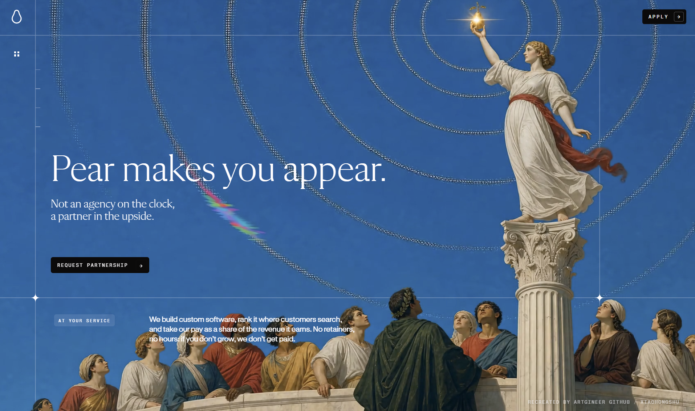
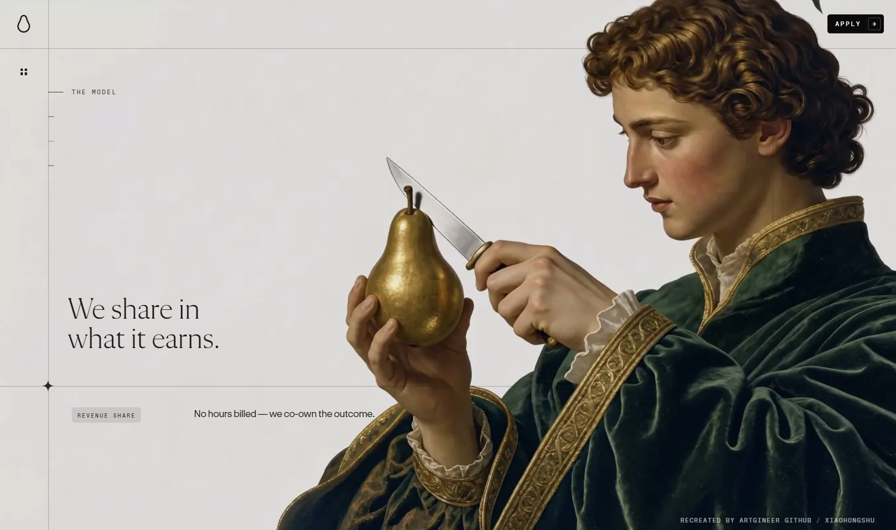

# Pear No Clone


这是一个基于 React + Vite 的 pear.no 网站体验复刻项目，重点还原滚动叙事、WebGL 背景、序列帧动画、遮罩合成和响应式布局。



## 项目内容

- 自定义 GLSL WebGL 首屏背景与人物影像
- Canvas 2D 序列帧、转场和 chroma-key 遮罩
- 桌面端与移动端一致的 road 滚动时间线
- 导航、章节 rail、FAQ 旋转内容和 footer 转场
- Application 表单场景与弹窗交互
- 可调节首屏 mask 的校准控制面板
- 首屏、fly、transition、footer 的资源加载与失败兜底



## 技术栈

- React 19
- Vite 6
- WebGL / GLSL
- HTML Canvas 2D
- SVG
- pnpm

## 快速开始

```bash
pnpm install
pnpm dev
```

默认开发服务地址：

`http://localhost:3000/`

生产构建与预览：

```bash
pnpm build
pnpm preview
```

## 页面交互

### 首屏 loading

首屏 loading 由真实资源状态驱动。Poster 或 hero video 可绘制后，loading 状态自动消失；不会因为固定延时导致空白画布提前出现。

如果首屏资源连续 10 秒无法加载，页面会显示错误信息和 `Retry` 按钮。

fly、transition 和 footer 阶段采用非阻塞加载。资源尚未完成时，会继续显示最近可用帧，并在底部提示当前加载阶段，避免快速滚动造成黑屏。


### Mask 校准面板

校准面板默认隐藏。双击页面空白区域即可打开或关闭。

面板提供以下控制项：

- `Zoom / Overscan`
- `Object Position X`
- `Sky Sensitivity`
- mask debug 开关
- reset 与 preset
- road 位置读取与拖拽定位

校准参数会保存到浏览器的 `localStorage` 中。

### Application 场景

Application 区域包含三个虚线椭圆、发光粒子、表单字段和发送按钮。椭圆保持与原站一致的静态姿态，避免出现异常快速旋转。

## 资源结构

- `src/App.jsx`：页面组合、滚动状态和全局交互
- `src/components/`：页面区块、Canvas、弹窗和加载状态组件
- `src/glsl/`：hero 与 footer transition shader
- `public/films/`：视频、海报和序列帧资源
- `docs/assets/`：README 展示图片

## 复刻说明

本项目用于本地研究和技术学习。项目中的视觉素材、品牌和原站内容仍归其原作者所有，请勿未经授权用于商业发布。

## Credits

Recreated by Artgineer

- [GitHub](https://github.com/amasun?tab=repositories)
- [Xiaohongshu](https://www.xiaohongshu.com/user/profile/5c094b50f7e8b948da476607)

