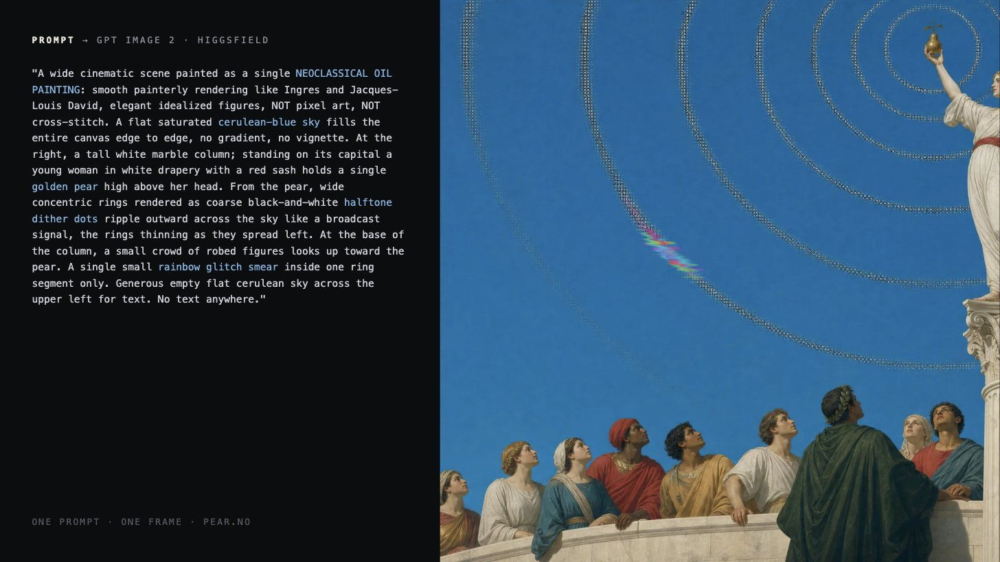

# Pear.no 复刻：技术复盘与可复用经验

## 目标与边界

本项目不是从设计稿还原一个静态落地页，而是复刻 `pear.no` 的叙事式滚动体验：画面、文案、网格线、视频/序列帧、表单和场景之间的关系均由同一条时间轴驱动。

本文区分两件事：

- **原站创作管线**：作者公开描述的素材与制作方式。
- **本复刻实现**：为了在浏览器中还原体验所采用的 React、Canvas、WebGL、SVG 与 CSS 方案。

## 原站的创作管线

作者的核心观点并不是“AI 取代网站制作”，而是把视觉方向、素材生产和前端实现压缩到一套紧密联动的流程中：

1. **静帧**：用 Higgsfield 中的 GPT Image 2 生成画面。
2. **统一世界观**：维护一个可复用的 prompt skeleton，让每张图共享同样的绘画语言、构图纪律与留白逻辑。
3. **慢速影像**：以 Seedance 2 将静帧扩展为慢节奏电影片段。
4. **直接实现**：在 Claude Code 中以 Fable 5 完成生产代码，不经过 Figma。
5. **颜色采样**：金色与天青色并非先行的品牌规范，而是从绘画本身抽取，再反向成为界面颜色。

这套方法的价值在于：先让素材在同一个视觉宇宙中成立，再让代码负责节奏、空间和交互。生成图像只能提供原料，网站的品质仍取决于镜头、留白、分层、时间控制和对异常帧的处理。

### Prompt skeleton 的启发

作者提供的示例以“宽幅、单幅、新古典油画”为总约束，再指定：平涂高饱和 cerulean-blue 天空、古典人物与建筑、金色梨、半色调同心环、单处彩虹故障、为界面文字预留的干净区域，以及“无渐变、无暗角、画面内不含文字”等负向限制。

可复用的写法是：

`全局风格 + 镜头/构图 + 主体与动作 + 材质/纹理 + 色彩锚点 + 特殊符号 + 文案安全区 + 明确禁止项`

其中“文案安全区”和“明确禁止项”尤其重要。它们使生成素材可以承载真实界面，而不是只能作为背景图。

### 示例场景的完整提示词

以下为作者展示的“一条 prompt，一个画面”示例原文：

```text
"A wide cinematic scene painted as a single NEOCLASSICAL OIL
PAINTING: smooth painterly rendering like Ingres and Jacques-
Louis David, elegant idealized forms, NOT pixel art, NOT
cross-stitch. A flat saturated cerulean-blue sky fills the
entire canvas edge to edge, no gradient, no vignette. At the
right, a tall white marble column; standing on its capital a
young woman in white drapery with a red sash holds a single
golden pear high above her head. From the pear, wide
concentric rings rendered as coarse black-and-white halftone
dither dots ripple outward across the sky like a broadcast
signal, the rings thinning and spreading left. At the base of
the column, a small crowd of robed figures looks up toward the
pear. A single small rainbow glitch smear inside one ring
segment only. Generous empty flat cerulean sky across the
upper left for text. No text anywhere."
```



### 示例场景的关键元素与关键词拆分

| 层级 | 作用 | 原文中的关键元素 / 关键词 |
| --- | --- | --- |
| 输出形态 | 先定义画幅和镜头感，避免生成出单一头像或局部物件 | `wide cinematic scene`、`single` |
| 核心画风 | 锁定整个世界的视觉语言 | `NEOCLASSICAL OIL PAINTING`、`smooth painterly rendering`、`Ingres`、`Jacques-Louis David`、`elegant idealized forms` |
| 负向媒介约束 | 排除容易跑偏的低保真纹理和像素化风格 | `NOT pixel art`、`NOT cross-stitch` |
| 天空与底色 | 建立整幅画最强的色彩锚点与平面感 | `flat saturated cerulean-blue sky`、`entire canvas edge to edge`、`no gradient`、`no vignette` |
| 主构图 | 指定视线起点、人物位置和画面重心 | `At the right`、`tall white marble column`、`standing on its capital` |
| 人物造型 | 给角色明确的古典材料、服装和姿态 | `young woman`、`white drapery`、`red sash` |
| 核心符号 | 把品牌对象放在最高视觉优先级 | `single golden pear`、`high above her head` |
| 信号语言 | 将品牌符号转成可延展的背景图形 | `wide concentric rings`、`coarse black-and-white halftone dither dots`、`broadcast signal`、`rings thinning and spreading left` |
| 叙事陪体 | 用次级人物建立尺度、方向和观看关系 | `small crowd of robed figures`、`looks up toward the pear` |
| 有限异常 | 只允许一个受控的数字故障点，保留画面秩序 | `single small rainbow glitch smear`、`inside one ring segment only` |
| UI 安全区 | 为真实的网页标题/导航预留不干扰阅读的区域 | `Generous empty flat cerulean sky`、`upper left for text` |
| 无字约束 | 阻止图像模型自行生成不可控文字 | `No text anywhere` |

可把这张表理解为一个顺序明确的生成配方：**先定媒介与画幅，再定底色和主构图，随后植入品牌符号与可重复纹理，最后留出界面空间并用负向约束收口。**

其结构值得直接保留：先锁定画种与参考艺术家，再用两条 `NOT` 排除错误媒介；中段从右侧主角、金色梨到半色调信号环逐层添加可识别符号；最后明确左上文案安全区和“画面内无文字”。

## 本复刻的技术栈

- **React + Vite**：组件化场景、状态管理与生产构建。
- **原生 WebGL / GLSL**：Hero 影片画面、色键遮罩和转场效果。
- **Canvas 2D**：FLY / transition 的 WebP 序列帧绘制、帧交叉淡化和细线遮罩。
- **HTML / CSS 3D**：Application 表单、透视层级、悬停深度和轨道椭圆。
- **SVG Filter**：`feTurbulence`、`feDisplacementMap`、`feComponentTransfer` 与 `feComposite` 组成 Ink 文字的水墨浸染出现。
- **滚动时间轴**：全站使用以 `ROAD` 表示的映射进度，而非把浏览器原始 scrollY 直接当作动画进度。
- **响应式布局**：桌面与移动端共享叙事节点，但采用独立的取景、物体锚点、缩放和序列帧素材分支。

## 关键实现要素

### 1. 一条可校准的 Road 时间轴

`timeline.js` 将原始页面滚动映射为逻辑进度，并提供反向映射。因此每个场景只关心自身的 Road 区间，例如：模型、Work、Terms / Ink、FAQ、FLY、Application、transition 和 Footer。

好处：

- 点击顶部 Apply 可以直接定位至 Application 的目标 Road，而不是以平滑滚动穿过所有章节。
- Road 面板既能显示阶段名，也能点击、拖拽和用键盘精确跳转。
- 移动端可有不同的滚动长度分配，叙事仍对齐同一组逻辑节点。

经验：任何长滚动叙事页都应先定义“逻辑时间”，再把物理滚动映射进来。否则，当某个场景延长或移动端节奏不同，所有阈值都会失控。

### 2. 素材不是普通背景图

影片和帧序列应使用明确的 cover 公式、取景锚点与超采样参数，而不是只依赖 `object-fit: cover`。尤其在移动端，错误复用桌面宽高比或序列帧目录，会导致人物被拉伸、构图漂移或相邻帧接不上。

本复刻中，帧序列根据屏宽选择对应分支；图像按自然尺寸计算覆盖缩放，再用场景进度改变水平取景。FLY 尾帧与下一段 transition 在限定 Road 窗口中交叉淡化，避免硬切。

经验：生成视频转成序列帧后，要逐段检查首帧、末帧、横竖版、透明度和色彩空间。素材目录正确不代表视觉连续正确。

### 3. 网格线是场景，不是固定 UI

纵横线、交叉星形、颜色和端点位置都随场景移动、收缩或消失。它们必须由时间轴状态计算，而不应只是一组固定 `position: absolute` 的装饰元素。

关键处理包括：

- 初始遮罩只服务开场，用户开始滚动后及时移除。
- 线条与交叉标记使用独立的进场、锁定、退场系数。
- 在 Road 977 一类的转场节点，所有交叉标记必须同步退出，避免只遗留上方两枚星形。
- 深色、浅色场景切换时，线色来自同一状态源，保证与背景可读性一致。

### 4. Ink 效果需要真正的 alpha 合成

水墨文字不是“文字模糊后渐显”。正确链路是：

1. 用分形噪声生成不规则场。
2. 通过 alpha 阈值把噪声变成可控蒙版。
3. 对源文字做轻微位移，产生纸张吸墨的边缘扰动。
4. 用 `feComposite operator="in"` 把位移结果裁切进噪声蒙版。
5. 随时间降低位移、模糊和对比度，最终得到清晰文字。

缺少第 4 步时，效果会退化为普通的模糊位移，无法形成“被墨迹逐步显出”的边缘。

### 5. 表单 hover 应由合成层稳定完成

Application 表单的 hover 不应触发布局变化。复刻中采用 `translate3d + rotateZ + scale`：当前字段轻微上浮、前移并放大，其他字段轻度降亮；同时以 `will-change: transform, filter, opacity` 和统一的缓动曲线让浏览器将变化放在合成层处理。

一次实际问题是：全局 `.cf-f` 规则覆盖了组件内的 `transform` transition，造成 hover 跳变和抖动。用作用域更强的 `.cf .cf-f` 规则后，`transform`、`filter` 和 `opacity` 都进入同一条过渡，运动才稳定。

经验：当动画“看上去像性能问题”时，先检查计算后的 CSS，而不是先增加节流或复杂状态机。选择器覆盖常常才是根因。

## 方案亮点

- **素材、文字和交互共用同一时间轴**：没有把视觉层和交互层割裂为两个页面。
- **以原站运行时行为校准复刻**：通过捕获的运行时逻辑与场景截图，核对阈值、遮罩和进退场，而不只凭静态视觉猜测。
- **可操作的校准面板**：Road 可点击、拖拽、键盘寻址，手柄有更大的命中热区；这使逐帧比对和修正具备效率。
- **可解释的移动端策略**：移动端不是简单缩放桌面，而是独立调整取景、字体、锚点、序列素材与交互热区。
- **渐变之外的视觉统一性**：从绘画取样的金色和 cerulean 蓝，配合线条、半色调、噪声和水墨边缘，形成了比“品牌色 + CSS 渐变”更有物质感的系统。

## 复刻过程中的常见问题与修复原则

| 问题 | 根因 | 修复原则 |
| --- | --- | --- |
| 场景间黑屏或帧错乱 | 时间窗口断开、序列帧索引或来源错误 | 明确每段 start/end，保留必要的交叉淡化窗口 |
| 图片在移动端变形 | 使用桌面素材或错误的覆盖公式 | 使用移动素材分支，按自然尺寸计算 cover 和锚点 |
| 文案顺序反向或混入下一场 | 多组内容共享错误的进度条件 | 为每组文案定义独立出现、持有、退出窗口 |
| Ink 像普通模糊 | SVG filter 缺 alpha 合成 | 完整保留噪声阈值、位移与 composite 链路 |
| Apply 顺滑扫过全站 | 使用 `behavior: smooth` | 使用反向时间轴映射并以 `behavior: auto` 直接定位 |
| Hover 抖动 | transform transition 被覆盖，或使用布局属性动画 | 检查 computed style；只动画 transform/filter/opacity |
| 网格与画面脱节 | 把线条写成固定装饰 | 让位置、长度、颜色、星形均由场景状态驱动 |

## 推荐的复刻工作流

1. **先定义章节与 Road 表**：建立所有场景的 start、hold、exit 节点。
2. **做可寻址的调试面板**：在开发初期就支持拖拽、点击和键盘跳转。
3. **逐段锁定素材取景**：优先修复首末帧、纵横比和移动端锚点。
4. **再处理覆盖层**：网格、文案、shader、遮罩和特效应建立在稳定素材之上。
5. **用计算后样式定位 CSS 问题**：检查实际生效的 transition、filter、transform 和 opacity。
6. **做桌面与移动端抽样验收**：至少覆盖每段开场、中段、退出，以及两个场景的交界。
7. **每次修改都构建**：避免只在开发热更新里成立，而生产构建出现资源或样式差异。

## 结论

“GPT Image 2 + Seedance 2 + Claude Code / Fable 5”能够快速生成有辨识度的创意网页原料，但不会自动得到一个好的交互作品。真正决定成品质量的是：统一的 prompt 世界观、可控的素材连续性、逻辑时间轴、正确的遮罩/合成、响应式取景，以及对每一个场景交界的耐心校准。

对创意网站而言，AI 缩短了从构思到素材与代码的距离；它没有消除前端工程、运动设计和视觉判断，只是让这些能力更集中地体现在最终体验里。
